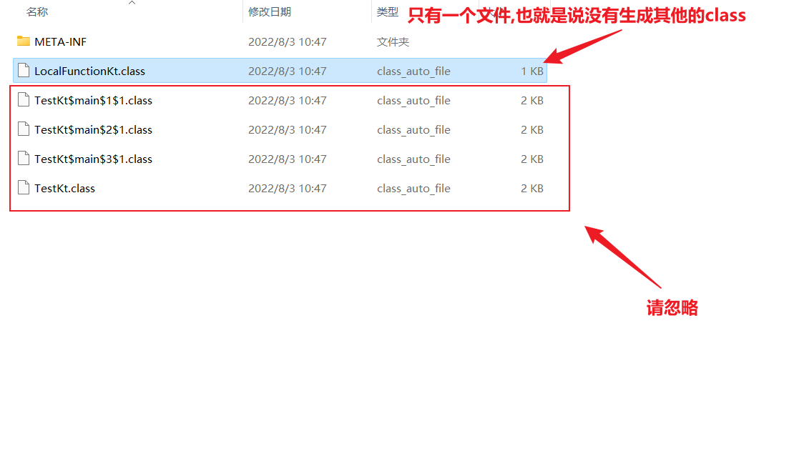

# 高阶函数

什么是高阶函数,所谓高阶函数。
在数学和计算机科学中，高阶函数是**至少**满足下列一个条件的函数:

- 接受一个或多个函数作为输入
- 输出一个函数

kotlin语言需要在jvm上运行(但不是只能),而java是不支持高阶函数的,java没有高阶函数,只有方法.

kotlin在jvm上运行又是怎么实现的呢?

看下字节码不就会了

```kotlin
fun function(block: (Int) -> Unit) {
    block(1)
}

fun main() {
    function { }
}

```

```
# 高阶函数最后被编译成了一个类也即是Fuction类
# FunctionN表示输入参数的个数Function1表示输入参数为1个的函数类型.
public final static function(Lkotlin/jvm/functions/Function1;)V
    # checkNotNull
   L0
    ALOAD 0
    LDC "block"
    INVOKESTATIC kotlin/jvm/internal/Intrinsics.checkNotNullParameter (Ljava/lang/Object;Ljava/lang/String;)V
   L1
    LINENUMBER 8 L1
    ALOAD 0
    ICONST_1
    # block.invoke()
    INVOKESTATIC java/lang/Integer.valueOf (I)Ljava/lang/Integer;
    INVOKEINTERFACE kotlin/jvm/functions/Function1.invoke (Ljava/lang/Object;)Ljava/lang/Object; (itf)
    POP
   L2
    LINENUMBER 9 L2
    RETURN
}


public final static main()V
   L0
    LINENUMBER 14 L0
    GETSTATIC TestKt$main$1.INSTANCE : LTestKt$main$1;          
    #获取内部类的静态属性
    CHECKCAST kotlin/jvm/functions/Function1    #强转
    INVOKESTATIC TestKt.function (Lkotlin/jvm/functions/Function1;)V
    # 调用function函数
   L1
    LINENUMBER 29 L1
    RETURN

   # 嘿还有一个内部类
  final static INNERCLASS TestKt$main$1 null null
}

```

代码等价于

```java
public static void main(){
        function((Function1<Int, Unit>)TestKt$main$1.INSTANCE)
        }
```

上面的逻辑中使用到了一个名为TestKt$main$1的内部类


所以高阶函数的实现还是比较简单的
类似于java的匿名类的实现,通过编译器生成一个内部类并实现相应的接口(名称的生成规则都是类似的)
但是不同的是————**java的匿名类在每一次调用都会直接new,但是kotlin的高阶函数是一个饿汉式的单例**

留给读者一个简单的小问题
下方代码会new多少个Function1实例?

```kotlin
fun main() {

    repeat(10) {
        function {}
    }

    repeat(10) {
        function { }
    }

    repeat(10) {
        function { }
    }

}
```

答案是3个你答对了吗?

# 局部函数

**所谓局部函数就是在函数内部定义函数**

## 关于java

java显然在语法上是不支持的.
这样的代码显然是会报错的.

```java
public class Test {
    public static void main(String[] args) {

        public void doSome () {
            System.out.println("This is a local method");
        }

        doSome();

    }
}
```

## 关于Kotlin

kotlin显然是支持这样的写法的.

```kotlin
fun main() {
    fun localFunction() {
        println("I am local function")
    }

    localFunction()

}

```

## 实现原理

秉承着知其然知其所以然,很有必要知道这样一个方便的语法特性是如何是如何实现的.
打开show kotlin bytecode插件decompile ohh~
好像看不懂

```java
public final class LocalFunctionKt {
    public static final void main() {
      <undefinedtype > $fun$localFunction$1 = null.INSTANCE;
        $fun$localFunction$1.invoke();
    }

    // $FF: synthetic method
    public static void main(String[] var0) {
        main();
    }
}
```

考虑看看有咩有额外的的class生成,
经分析后发现显然没有


接着分析字节码


```
{
  public static final void main();
    descriptor: ()V
    flags: (0x0019) ACC_PUBLIC, ACC_STATIC, ACC_FINAL
    Code:
      stack=0, locals=0, args_size=0
         0: invokestatic  #9                  // Method main$localFunction:()V
         3: return

  public static void main(java.lang.String[]);
    descriptor: ([Ljava/lang/String;)V
    flags: (0x1009) ACC_PUBLIC, ACC_STATIC, ACC_SYNTHETIC
    Code:
      stack=0, locals=1, args_size=1
         0: invokestatic  #12                 // Method main:()V
         3: return
      LocalVariableTable:
        Start  Length  Slot  Name   Signature
            0       4     0  args   [Ljava/lang/String;

  private static final void main$localFunction();
    descriptor: ()V
    flags: (0x001a) ACC_PRIVATE, ACC_STATIC, ACC_FINAL
    Code:
      stack=2, locals=0, args_size=0
         0: ldc           #16                 // String I am local function
         2: getstatic     #22                 // Field java/lang/System.out:Ljava/io/PrintStream;
         5: swap
         6: invokevirtual #28                 // Method java/io/PrintStream.println:(Ljava/lang/Object;)V
         9: return
      LineNumberTable:
        line 3: 0
        line 4: 9
}
```

代码等价于

```java
public final class LocalFunctionKt {
   public static final void main() {
      main$localFunction();
   }

   public static void main(String[] args) {
      main();
   }

   private static final void main$localFunction() {
      System.out.println("I am local function");
   }
}
```

- 所以kotlin的局部函数其实也就是普通的函数
- 编译以后是同级的
- 其实现原理也就是通过编译器静态检查从而实现所谓的局部