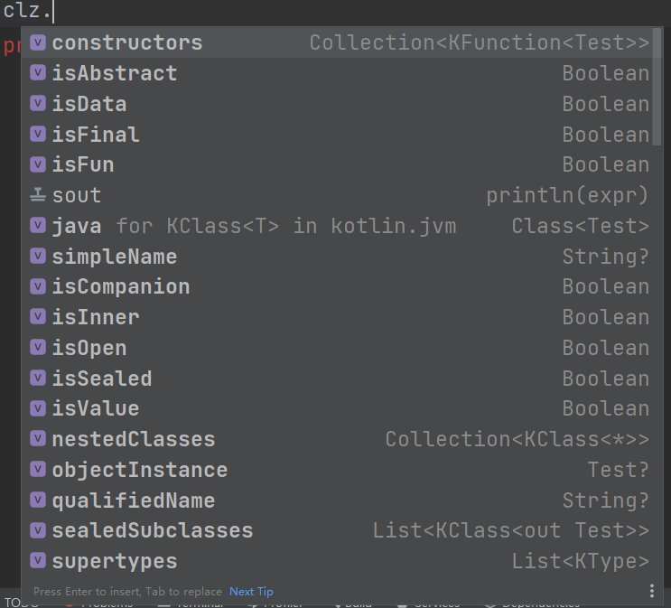
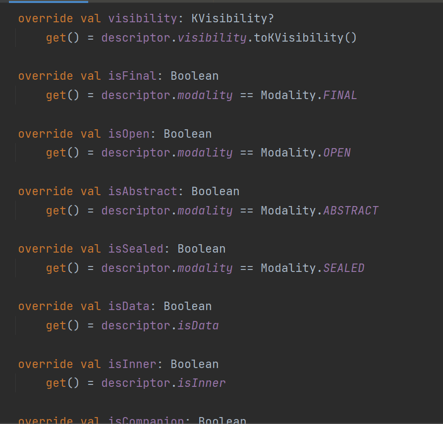
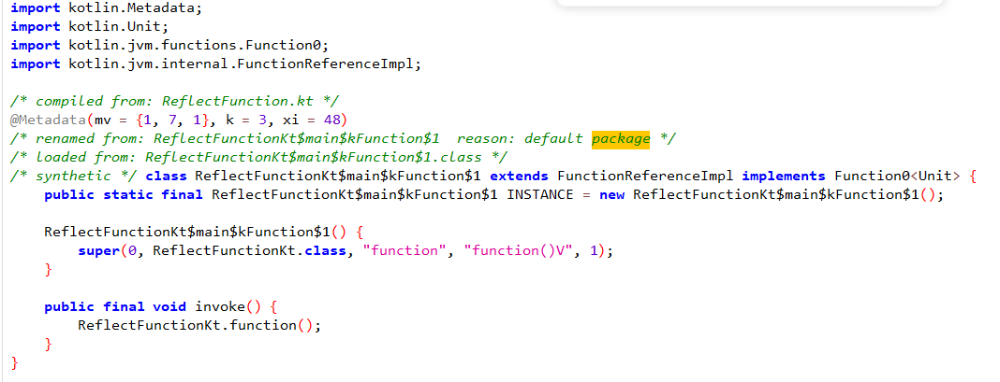
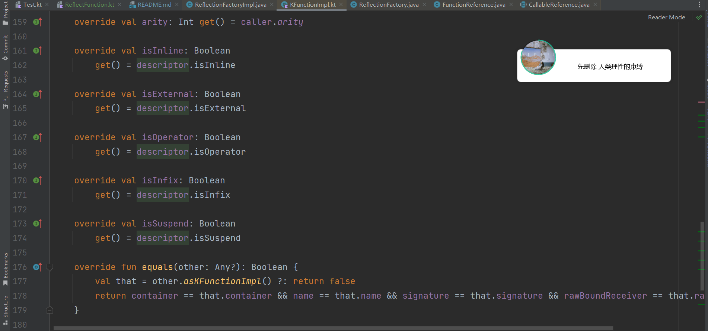
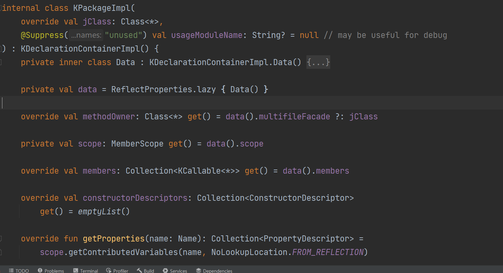

# reflection

> reflection又叫反射,Kotlin reflection不是对java反射的重写,因为java反射逻辑实现依靠jvm实现的,重写就意味着摈弃.

> kotlin reflection是对于java反射的扩展

## 为什么需要扩展

因为kotlin运行在jvm虚拟机上,kotlin真正独特的是它的编译器,它的海量的的语法特性都是通过编译器来提供支持的。

正是由于又有了这些语法特性使得kotlin成为了一门独特的语言,有很多地方他和java是类似的,但是又有很多地方是不相同的.

而jvm并不认识kotlin,对于kotlin的一些如data class,suspend,inline,sealed class显然是不能识别的,但是如果需要对这些类型进行特定的处理,那...显然是困难的

所以就有了kotlin reflection对于java反射的增强

## 如何引入kotlin reflection

kotlin reflection的支持需要引入一个依赖

```kotlin
dependencies {
    implementation("org.jetbrains.kotlin:kotlin-reflect:1.7.10")
}
```

## class reference

即`类引用`

```kotlin
class Test {}

fun main() {
    val clz = Test::class
    println(clz)
}
```

KClass应该是老朋友了,对应的KFunction,KProperty......


能访问到的成员也非常的多


### 实现原理

反编译的java代码为

```kotlin
public final class TestKt {
    public static final void main()
    {
        KClass clz = Reflection . getOrCreateKotlinClass (Test.class);
        System.out.println(clz);
    }
}
```

```java
/**
 * This class serves as a facade to the actual reflection implementation. JVM back-end generates calls to static methods of this class
 * on any reflection-using construct.
 */
@SuppressWarnings({"unused", "rawtypes"})
public class Reflection {
    //......
}
```

Reflection使用了门面模式,他作为真正反射实现类的中转类.
Kotlin-JVM编译器后端会生成对于该类的静态调用

#### kclass的创建

**好了回归正轨**

```java
KClass clz=Reflection.getOrCreateKotlinClass(Test.class);
```

```java
public class Reflection {
    private static final ReflectionFactory factory;

    static {
        ReflectionFactory impl;
        try {
            //采用反射去获取实现类(只有导入了kotlin-reflection包才会成功)
            Class<?> implClass = Class.forName("kotlin.reflect.jvm.internal.ReflectionFactoryImpl");
            impl = (ReflectionFactory) implClass.newInstance();
        } catch (ClassCastException e) {
            impl = null;
        } catch (ClassNotFoundException e) {
            impl = null;
        } catch (InstantiationException e) {
            impl = null;
        } catch (IllegalAccessException e) {
            impl = null;
        }
        //没有导入reflection包就只会拿到new一个reflectionFactory
        factory = impl != null ? impl : new ReflectionFactory();
    }

    public static KClass getOrCreateKotlinClass(Class javaClass) {
        return factory.getOrCreateKotlinClass(javaClass);
    }
}
```

具体实现

```java
public class ReflectionFactoryImpl extends ReflectionFactory {
    //......
    @Override
    public KClass getOrCreateKotlinClass(Class javaClass) {
        return KClassCacheKt.getOrCreateKotlinClass(javaClass);
    }

    //......

}
```

```kotlin

// TODO: collect nulls periodically
// 核心 !!!
// 这个map的key是Class.getName()，而value是WeakReference<KClassImpl<*>> or an Array<WeakReference<KClassImpl<*>>>
// 之所以使用array是因为一个jclass可能被不同的classloader加载从而使得clz具有不同的实例.(你可以看见从map里面获取的kclass对比依据一是name,二就是jclass实现)
// 除此之外这个map故意没有做线程同步,因为数据是否发生竞争或者丢失其实是不重要的.
// 这里唯一需要关注就是访问的性能,因此没有做同步
// Key of the map is Class.getName(), each value is either a WeakReference<KClassImpl<*>> or an Array<WeakReference<KClassImpl<*>>>.
// Arrays are needed because the same class can be loaded by different class loaders, which results in different Class instances.
// This variable is not volatile intentionally: we don't care if there's a data race on it and some KClass instances will be lost.
// We do care however about general performance on read access to it, thus no synchronization is done here whatsoever
private var K_CLASS_CACHE = HashPMap.empty<String, Any>()

// 强调可能会被频繁调用,所以这里的性能比较重要
// This function is invoked on each reflection access to Java classes, properties, etc. Performance is critical here.
internal fun <T : Any> getOrCreateKotlinClass(jClass: Class<T>): KClassImpl<T> {
    val name = jClass.name
    //从自定义的map里面去获取
    val cached = K_CLASS_CACHE[name]
    //如果获取到值
    if (cached is WeakReference<*>) {
        @Suppress("UNCHECKED_CAST")
        val kClass = cached.get() as KClassImpl<T>?
        if (kClass?.jClass == jClass) {
            //直接返回
            return kClass
        }
    } else if (cached != null) {
        // If the cached value is not a weak reference, it's an array of weak references
        // 如果不是weakReference那么就会是一个弱引用list
        @Suppress("UNCHECKED_CAST")
        (cached as Array<WeakReference<KClassImpl<T>>>)
        //遍历弱引用表,如果有就直接return
        for (ref in cached) {
            val kClass = ref.get()
            if (kClass?.jClass == jClass) {
                //直接返回
                return kClass
            }
        }

        // This is the most unlikely case: we found a cached array of references of length at least 2 (can't be 1 because
        // the single element would be cached instead), and none of those classes is the one we're looking for
        // 此处声明cache里面的class数目不太可能是1个,如果是一个会走上面的if分支.而且需要满足list内无满足条件的kclass才会执行到此处.


        // 如果没有寻找到kclass就就new一个实现类放入list并存入map里面
        val size = cached.size
        val newArray = arrayOfNulls<WeakReference<KClassImpl<*>>>(size + 1)
        // Don't use Arrays.copyOf because it works reflectively
        // 不要使用Arrays.copyOf因为他使用了反射
        // 感兴趣的自己去看,Arrays.copyOf会通过反射创建数组,并调用Systm.arraycopy来实现数组的拷贝
        // why?为什么这点性能都需要追求,因为在函数定义处dev给了我们解释：
        // 这个方法每当反射或者说::都会被调用，所以需要追求性能.
        System.arraycopy(cached, 0, newArray, 0, size)
        val newKClass = KClassImpl(jClass)
        newArray[size] = WeakReference(newKClass)
        K_CLASS_CACHE = K_CLASS_CACHE.plus(name, newArray)
        return newKClass
    }

    //如果map内没有list
    //一样的套路,new再放入map
    val newKClass = KClassImpl(jClass)
    K_CLASS_CACHE = K_CLASS_CACHE.plus(name, WeakReference(newKClass))
    return newKClass
}

```

#### kclass内容的获取

前面分析了KClass的获取

现在分析一下他是如何解析出这些class文件的内容的.


突破口在data




再一眼发现突破口再data.descriptor

```kotlin
val data = ReflectProperties.lazy { Data() }
```

```java
public class ReflectProperties {
    //......

    @NotNull
    public static <T> LazyVal<T> lazy(@NotNull Function0<T> initializer) {
        return new LazyVal<T>(initializer);
    }

    //......
}
```

这就是一个自己实现的lazy方法

```java
public static class LazyVal<T> extends Val<T> {
    private final Function0<T> initializer;
    private volatile Object value = null;

    public LazyVal(@NotNull Function0<T> initializer) {
        this.initializer = initializer;
    }

    @Override
    public T invoke() {
        Object cached = value;
        if (cached != null) {
            return unescape(cached);
        }

        T result = initializer.invoke();
        value = escape(result);

        return result;
    }
}


public static abstract class Val<T> {
    private static final Object NULL_VALUE = new Object() {
    };

    @SuppressWarnings({"UnusedParameters", "unused"})
    public final T getValue(Object instance, Object metadata) {
        return invoke();
    }

    public abstract T invoke();

    protected Object escape(T value) {
        return value == null ? NULL_VALUE : value;
    }

    @SuppressWarnings("unchecked")
    protected T unescape(Object value) {
        return value == NULL_VALUE ? null : (T) value;
    }
}
```

接着看descriptor

```kotlin

val descriptor: ClassDescriptor by ReflectProperties.lazySoft {
    val classId = classId
    val moduleData = data().moduleData

    val descriptor =
        if (classId.isLocal) moduleData.deserialization.deserializeClass(classId)
        else moduleData.module.findClassAcrossModuleDependencies(classId)

    descriptor ?: reportUnresolvedClass()
}
```

关于这个lazySoft就是一个弱引用的lazyProperty

```java
public static class LazySoftVal<T> extends Val<T> implements Function0<T> {
    private final Function0<T> initializer;
    private volatile SoftReference<Object> value = null;

    public LazySoftVal(@Nullable T initialValue, @NotNull Function0<T> initializer) {
        this.initializer = initializer;
        if (initialValue != null) {
            this.value = new SoftReference<Object>(escape(initialValue));
        }
    }

    @Override
    public T invoke() {
        SoftReference<Object> cached = value;
        if (cached != null) {
            Object result = cached.get();
            if (result != null) {
                return unescape(result);
            }
        }

        T result = initializer.invoke();
        value = new SoftReference<Object>(escape(result));

        return result;
    }
}
```

```kotlin
val classId = classId

private val classId: ClassId get() = RuntimeTypeMapper.mapJvmClassToKotlinClassId(jClass)


fun mapJvmClassToKotlinClassId(klass: Class<*>): ClassId {
    if (klass.isArray) {
        klass.componentType.primitiveType?.let {
            return ClassId(StandardNames.BUILT_INS_PACKAGE_FQ_NAME, it.arrayTypeName)
        }
        return ClassId.topLevel(StandardNames.FqNames.array.toSafe())
    }

    if (klass == Void.TYPE) return JAVA_LANG_VOID

    klass.primitiveType?.let {
        return ClassId(StandardNames.BUILT_INS_PACKAGE_FQ_NAME, it.typeName)
    }

    val classId = klass.classId
    if (!classId.isLocal) {
        JavaToKotlinClassMap.mapJavaToKotlin(classId.asSingleFqName())?.let { return it }
    }

    return classId
}
```

```kotlin
val moduleData: RuntimeModuleData by ReflectProperties.lazySoft {
    jClass.getOrCreateModule()
}
```

```kotlin
private val moduleByClassLoader: ConcurrentMap<WeakClassLoaderBox, WeakReference<RuntimeModuleData>> =
    ConcurrentHashMap()

internal fun Class<*>.getOrCreateModule(): RuntimeModuleData {
    val classLoader = this.safeClassLoader

    val key = WeakClassLoaderBox(classLoader)

    val cached = moduleByClassLoader[key]
    //如果cache命中了,直接返回值
    if (cached != null) {
        cached.get()?.let { return it }
        moduleByClassLoader.remove(key, cached)
    }
    //如果没有命中就通过静态方法新创建一个
    val module = RuntimeModuleData.create(classLoader)
    try {
        while (true) {
            //存放入hashMap并把module值return
            val ref = moduleByClassLoader.putIfAbsent(key, WeakReference(module)) ?: return module

            val result = ref.get()
            if (result != null) return result
            moduleByClassLoader.remove(key, ref)
        }
    } finally {
        key.temporaryStrongRef = null
    }
}
```

```kotlin
class RuntimeModuleData private constructor(
    val deserialization: DeserializationComponents,
    val packagePartScopeCache: PackagePartScopeCache
) {
    val module: ModuleDescriptor get() = deserialization.moduleDescriptor

    companion object {
        //创建并返回实例
        fun create(classLoader: ClassLoader): RuntimeModuleData {
            //这个类比较重要,他会去解析class的annotation中的metadata
            //这一解析就能得到一些raw data(干巴巴的数据),再进行一次解析就能转化为可使用的bean
            val kotlinClassFinder = ReflectKotlinClassFinder(classLoader)
            val moduleData = createModuleData(
                kotlinClassFinder = kotlinClassFinder,
                // .kotlin_builtins files should be found by the same class loader that loaded stdlib classes
                jvmBuiltInsKotlinClassFinder = ReflectKotlinClassFinder(Unit::class.java.classLoader),
                javaClassFinder = ReflectJavaClassFinder(classLoader),
                moduleName = "runtime module for $classLoader",
                errorReporter = RuntimeErrorReporter,
                javaSourceElementFactory = RuntimeSourceElementFactory
            )
            return RuntimeModuleData(
                moduleData.deserializationComponentsForJava.components,
                PackagePartScopeCache(moduleData.deserializedDescriptorResolver, kotlinClassFinder)
            )
        }
    }
}
```

上述代码执行完毕以后就会一层层出栈,最后执行回到这里

```kotlin
val descriptor: ClassDescriptor by ReflectProperties.lazySoft {
    //finished        
    val classId = classId
    val moduleData = data().moduleData
    //获取解析器，依据不同情况获取不同的解析器
    val descriptor =
        if (classId.isLocal) moduleData.deserialization.deserializeClass(classId)
        //demo会走这一条
        else moduleData.module.findClassAcrossModuleDependencies(classId)

    descriptor ?: reportUnresolvedClass()
}
```

接着会经过

- ModuleDescriptor.findClassAcrossModuleDependencies
- ModuleDescriptor.withResolutionAnchor
- AbstractScopeAdapter.getContributedClassifier
- getFirstClassifierDiscriminateHeaders
- getContributedClassifier
- ReflectKotlinClassFinder.findKotlinClassOrContent
- ReflectKotlinClassFinder.findKotlinClass
- ReflectKotlinClass.create

最后的这个create调用比较重要因为他进行了metadata(属于元编程的范畴了)的解析

稍加分析以下最后一个调用

```kotlin
companion object Factory {
    fun create(klass: Class<*>): ReflectKotlinClass? {
        //类似于asm-core api的visitor
        //这个visitor会进行注解的解析
        val headerReader = ReadKotlinClassHeaderAnnotationVisitor()
        //解析类注解
        ReflectClassStructure.loadClassAnnotations(klass, headerReader)
        return ReflectKotlinClass(klass, headerReader.createHeader() ?: return null)
    }
}
```

```kotlin
private object ReflectClassStructure {
    fun loadClassAnnotations(klass: Class<*>, visitor: KotlinJvmBinaryClass.AnnotationVisitor) {
        //调用遍历所有注解进行解析
        for (annotation in klass.declaredAnnotations) {
            processAnnotation(visitor, annotation)
        }
        visitor.visitEnd()
    }

    private fun processAnnotation(visitor: KotlinJvmBinaryClass.AnnotationVisitor, annotation: Annotation) {
        //获取注解的类型
        val annotationType = annotation.annotationClass.java
        //进行访问(访问者模式)
        visitor.visitAnnotation(annotationType.classId, ReflectAnnotationSource(annotation))?.let {
            processAnnotationArguments(it, annotation, annotationType)
        }
    }
    //......
}
```

```java

public class ReadKotlinClassHeaderAnnotationVisitor implements AnnotationVisitor {
    public AnnotationArgumentVisitor visitAnnotation(@NotNull ClassId classId, @NotNull SourceElement source) {
        //获取注解名称
        FqName fqName = classId.asSingleFqName();
        //判断是否等于Metadata
        //public static final FqName METADATA_FQ_NAME = new FqName("kotlin.Metadata");
        if (fqName.equals(METADATA_FQ_NAME)) {
            //进一步解析
            return new KotlinMetadataArgumentVisitor();
        }

        if (IGNORE_OLD_METADATA) return null;

        if (headerKind != null) {
            // Ignore all Kotlin annotations except the first found
            return null;
        }

        KotlinClassHeader.Kind newKind = HEADER_KINDS.get(classId);
        if (newKind != null) {
            headerKind = newKind;
            return new OldDeprecatedAnnotationArgumentVisitor();
        }

        return null;
    }
}

```

这里逻辑就是用于解析kotlin.Metadata注解,不做详细介绍

```java
private class KotlinMetadataArgumentVisitor implements AnnotationArgumentVisitor {
    @Override
    public void visit(@Nullable Name name, @Nullable Object value) {
        if (name == null) return;
        String string = name.asString();
        if (KIND_FIELD_NAME.equals(string)) {
            if (value instanceof Integer) {
                headerKind = KotlinClassHeader.Kind.getById((Integer) value);
            }
        } else if (METADATA_VERSION_FIELD_NAME.equals(string)) {
            if (value instanceof int[]) {
                metadataVersionArray = (int[]) value;
            }
        } else if (METADATA_EXTRA_STRING_FIELD_NAME.equals(string)) {
            if (value instanceof String) {
                extraString = (String) value;
            }
        } else if (METADATA_EXTRA_INT_FIELD_NAME.equals(string)) {
            if (value instanceof Integer) {
                extraInt = (Integer) value;
            }
        } else if (METADATA_PACKAGE_NAME_FIELD_NAME.equals(string)) {
            if (value instanceof String) {
                packageName = (String) value;
            }
        }
    }

    @Override
    public void visitClassLiteral(@NotNull Name name, @NotNull ClassLiteralValue classLiteralValue) {
    }

    @Override
    @Nullable
    public AnnotationArrayArgumentVisitor visitArray(@NotNull Name name) {
        String string = name.asString();
        if (METADATA_DATA_FIELD_NAME.equals(string)) {
            return dataArrayVisitor();
        } else if (METADATA_STRINGS_FIELD_NAME.equals(string)) {
            return stringsArrayVisitor();
        } else {
            return null;
        }
    }

    @NotNull
    private AnnotationArrayArgumentVisitor dataArrayVisitor() {
        return new CollectStringArrayAnnotationVisitor() {
            @Override
            protected void visitEnd(@NotNull String[] result) {
                data = result;
            }
        };
    }

    @NotNull
    private AnnotationArrayArgumentVisitor stringsArrayVisitor() {
        return new CollectStringArrayAnnotationVisitor() {
            @Override
            protected void visitEnd(@NotNull String[] result) {
                strings = result;
            }
        };
    }

    @Override
    public void visitEnum(@NotNull Name name, @NotNull ClassId enumClassId, @NotNull Name enumEntryName) {
    }

    @Nullable
    @Override
    public AnnotationArgumentVisitor visitAnnotation(@NotNull Name name, @NotNull ClassId classId) {
        return null;
    }

    @Override
    public void visitEnd() {
    }
}
```

上述流程结束以后就会返回一个ReflectKotlinClass

```kotlin
class ReflectKotlinClass private constructor(
    val klass: Class<*>,
    override val classHeader: KotlinClassHeader
) : KotlinJvmBinaryClass {

    companion object Factory {
        fun create(klass: Class<*>): ReflectKotlinClass? {
            val headerReader = ReadKotlinClassHeaderAnnotationVisitor()
            ReflectClassStructure.loadClassAnnotations(klass, headerReader)
            return ReflectKotlinClass(klass, headerReader.createHeader() ?: return null)
        }
    }

    //......
}

```

然而ReflectKotlinClass是什么呢

```kotlin
class ReflectKotlinClass private constructor(
    //......
) : KotlinJvmBinaryClass
```

KotlinJvmBinaryClass可以看出是一个raw data,进行加工以后就可以成为可供使用的数据(即`KClassImpl`,`KPropertyImpl`
,`KFunction`)

具体解析过程可分析`DeserializedDescriptorResolver`

### 小结

- kotlin reflection没有重写java的反射,他们不冲突,kotlin reflection是在其基础上加入一些扩展
- kotlin reflection需要通过引入一个jar包的方式开启(不引入也没关系只是没有相应的扩展了,对于java反射没有任何影响)
- kotlin reflection源代码注释较少(代码量还大,分析起来很头大)
- kotlin reflection通过kotlin编译器生成metadata元数据,并在调用::创建一个K(Function/Class/Property)
  Impl,在调用具体的内容以后如KClassImpl.isData以后会去解析metadata的内容

### Q/A

有几个小问题

1. 在开启kotlin-reflection,未开启下方代码输出结果,为什么?

```kotlin
fun main() {
    val clz1 = Unit::class
    val clz2 = Unit::class
    println(clz1 === clz2)
}
```

2. 为什么需要kotlin reflection?它相比于java reflection做了哪些?
3. kotlin reflection是会去解析kotlin.Metadata注解,那对代码进行混淆以后是否会出现问题?
4. 我们都知道kotlin 在实例化KClassImpl的时候不是直接使用的强引用,而是采用的WeakReference为什么?
5. kotlin reflection的KClass的缓存会存在并发问题嘛?为什么?

答案

1. 没开启kotlin reflection返回时false,反之是true,因为没开启kotlin reflection类的获取是通过直接new,开启以后会放入一个map里面
2. kotlin reflection做了一些kotlin方面的扩展,比如可以用于判断是否是final,suspend,sealed class,open,data class,......
3. 并不会,kotlin reflection内容keep住了Metadata,当然你如果给他改了,那确实是在使用增强反射的时候会出大问题
4. 因为KClassImpl内部有太多的成员了,而且还会被频繁调用,一步留神就调用多了创建了很多实例就会导致内存飙升,如果不做限制oom可能性就大起来了,在这种情况WeakReference更适合做缓存
5.

显然存在,在设计上为了追求读取性能,资源竞争和数据丢失在设计的时候就没有关注,因为一旦关注就得加锁,无论是乐观锁还是悲观锁在一定程度上都会导致性能低下,而且多线程访问不加锁只会导致数据重复创建和覆盖(
在者Metadata是静态数据)所以不加锁也是可以接受的.

## function references

以下内容是kotlin ::操作符的进阶使用

在此之前可以参考[kotlin ::操作符初识](../callable-reference-operator)

```kotlin
fun main() {
    val kFunction = ::function
}

fun function() {

}
```

在之前我们分析了kotlin ::操作符的实现原理。
我们知道::function 会创建一个匿名类



分析kotlin反射的实现的切入点也只能是FunctionReferenceImpl

```java
//可以发现所有的构造函数都是调用的父类
public class FunctionReferenceImpl extends FunctionReference {
    public FunctionReferenceImpl(int arity, KDeclarationContainer owner, String name, String signature) {
        super(
                arity, NO_RECEIVER,
                ((ClassBasedDeclarationContainer) owner).getJClass(), name, signature,
                owner instanceof KClass ? 0 : 1
        );
    }

    @SinceKotlin(version = "1.4")
    public FunctionReferenceImpl(int arity, Class owner, String name, String signature, int flags) {
        super(arity, NO_RECEIVER, owner, name, signature, flags);
    }

    @SinceKotlin(version = "1.4")
    public FunctionReferenceImpl(int arity, Object receiver, Class owner, String name, String signature, int flags) {
        super(arity, receiver, owner, name, signature, flags);
    }
}
```

```java
//所有构造依然调用的父类
public class FunctionReference extends CallableReference implements FunctionBase, KFunction {
    private final int arity;

    /**
     * Bitmask where bits represent the following flags:<br/>
     * <li>
     *     <ul>0 - whether the vararg to element parameter type conversion happened, i.e.<pre>
     *         fun target(vararg xs: Int) {}
     *         fun use(f: (Int, Int, Int) -> Unit) {}
     *         use(::target)
     *     </pre></ul>
     *     <ul>1 - whether coercion of return type to Unit happened, i.e.<pre>
     *         fun target(): Boolean = true
     *         fun use(f: () -> Unit) {}
     *         use(::target)
     *     </pre></ul>
     *     <ul>2 - whether suspend conversion happened, i.e.,<pre>
     *         fun target() {}
     *         fun useSuspend(f: suspend () -> Unit) {}
     *         useSuspend(::target)
     *     </pre></ul>
     * </li>
     */
    @SinceKotlin(version = "1.4")
    private final int flags;

    public FunctionReference(int arity) {
        this(arity, NO_RECEIVER, null, null, null, 0);
    }

    @SinceKotlin(version = "1.1")
    public FunctionReference(int arity, Object receiver) {
        this(arity, receiver, null, null, null, 0);
    }

    @SinceKotlin(version = "1.4")
    public FunctionReference(int arity, Object receiver, Class owner, String name, String signature, int flags) {
        super(receiver, owner, name, signature, (flags & 1) == 1);
        this.arity = arity;
        this.flags = flags >> 1;
    }

    @Override
    public int getArity() {
        return arity;
    }

    @Override
    @SinceKotlin(version = "1.1")
    protected KFunction getReflected() {
        return (KFunction) super.getReflected();
    }

    @Override
    @SinceKotlin(version = "1.1")
    protected KCallable computeReflected() {
        return Reflection.function(this);
    }

    @Override
    @SinceKotlin(version = "1.1")
    public boolean isInline() {
        return getReflected().isInline();
    }

    @Override
    @SinceKotlin(version = "1.1")
    public boolean isExternal() {
        return getReflected().isExternal();
    }

    @Override
    @SinceKotlin(version = "1.1")
    public boolean isOperator() {
        return getReflected().isOperator();
    }

    @Override
    @SinceKotlin(version = "1.1")
    public boolean isInfix() {
        return getReflected().isInfix();
    }

    @Override
    @SinceKotlin(version = "1.1")
    public boolean isSuspend() {
        return getReflected().isSuspend();
    }

    @Override
    public boolean equals(Object obj) {
        if (obj == this) return true;
        if (obj instanceof FunctionReference) {
            FunctionReference other = (FunctionReference) obj;

            return getName().equals(other.getName()) &&
                    getSignature().equals(other.getSignature()) &&
                    flags == other.flags &&
                    arity == other.arity &&
                    Intrinsics.areEqual(getBoundReceiver(), other.getBoundReceiver()) &&
                    Intrinsics.areEqual(getOwner(), other.getOwner());
        }
        if (obj instanceof KFunction) {
            return obj.equals(compute());
        }
        return false;
    }

    @Override
    public int hashCode() {
        return ((getOwner() == null ? 0 : getOwner().hashCode() * 31) + getName().hashCode()) * 31 + getSignature().hashCode();
    }

    @Override
    public String toString() {
        KCallable reflected = compute();
        if (reflected != this) {
            return reflected.toString();
        }

        // TODO: consider adding the class name to toString() for constructors
        return "<init>".equals(getName())
                ? "constructor" + Reflection.REFLECTION_NOT_AVAILABLE
                : "function " + getName() + Reflection.REFLECTION_NOT_AVAILABLE;
    }
}
```

```java
/**
 * A superclass for all classes generated by Kotlin compiler for callable references. 
 * All methods from KCallable should be implemented here and should delegate to the actual implementation, loaded dynamically and stored in the reflected field.
 */
//简而言之就是具体实现function reflection的类
@SuppressWarnings({"unchecked", "NullableProblems", "rawtypes"})
public abstract class CallableReference implements KCallable, Serializable {
    // This field is not volatile intentionally:
    // 1) It's fine if the value is computed multiple times in different threads;
    // 2) An uninitialized value cannot be observed in this field from other thread because only already initialized or safely initialized
    //    objects are written to it. The latter is guaranteed because both KFunctionImpl and KPropertyImpl have at least one final field.
    private transient KCallable reflected;

    @SinceKotlin(version = "1.1")
    protected final Object receiver;

    @SinceKotlin(version = "1.4")
    private final Class owner;

    @SinceKotlin(version = "1.4")
    private final String name;

    @SinceKotlin(version = "1.4")
    private final String signature;

    @SinceKotlin(version = "1.4")
    private final boolean isTopLevel;

    @SinceKotlin(version = "1.1")
    public static final Object NO_RECEIVER = NoReceiver.INSTANCE;

    @SinceKotlin(version = "1.2")
    private static class NoReceiver implements Serializable {
        private static final NoReceiver INSTANCE = new NoReceiver();

        private Object readResolve() throws ObjectStreamException {
            return INSTANCE;
        }
    }

    public CallableReference() {
        this(NO_RECEIVER);
    }

    @SinceKotlin(version = "1.1")
    protected CallableReference(Object receiver) {
        this(receiver, null, null, null, false);
    }

    @SinceKotlin(version = "1.4")
    protected CallableReference(Object receiver, Class owner, String name, String signature, boolean isTopLevel) {
        this.receiver = receiver;
        this.owner = owner;
        this.name = name;
        this.signature = signature;
        this.isTopLevel = isTopLevel;
    }

    protected abstract KCallable computeReflected();

    @SinceKotlin(version = "1.1")
    public Object getBoundReceiver() {
        return receiver;
    }

    @SinceKotlin(version = "1.1")
    public KCallable compute() {
        KCallable result = reflected;
        if (result == null) {
            result = computeReflected();
            reflected = result;
        }
        return result;
    }

    @SinceKotlin(version = "1.1")
    protected KCallable getReflected() {
        KCallable result = compute();
        if (result == this) {
            throw new KotlinReflectionNotSupportedError();
        }
        return result;
    }

    // The following methods provide the information identifying this callable, which is used by the reflection implementation and
    // by equals/hashCode/toString. For callable references compiled prior to 1.4, these methods were overridden in each subclass
    // (each anonymous class generated for a callable reference).

    /**
     * @return the class or package where the callable should be located, usually specified on the LHS of the '::' operator
     */
    public KDeclarationContainer getOwner() {
        return owner == null ? null :
                isTopLevel ? Reflection.getOrCreateKotlinPackage(owner) : Reflection.getOrCreateKotlinClass(owner);
    }

    /**
     * @return Kotlin name of the callable, the one which was declared in the source code (@JvmName doesn't change it)
     */
    @Override
    public String getName() {
        return name;
    }

    /**
     * @return JVM signature of the callable, e.g. "println(Ljava/lang/Object;)V". If this is a property reference,
     * returns the JVM signature of its getter, e.g. "getFoo(Ljava/lang/String;)I". If the property has no getter in the bytecode
     * (e.g. private property in a class), it's still the signature of the imaginary default getter that would be generated otherwise.
     *
     * Note that technically the signature itself is not even used as a signature per se in reflection implementation,
     * but only as a unique and unambiguous way to map a function/property descriptor to a string.
     */
    public String getSignature() {
        return signature;
    }

    // The following methods are the delegating implementations of reflection functions. They are called when you're using reflection
    // on a callable reference. Without kotlin-reflect.jar in the classpath, getReflected() throws an exception.

    @Override
    public List<KParameter> getParameters() {
        return getReflected().getParameters();
    }

    @Override
    public KType getReturnType() {
        return getReflected().getReturnType();
    }

    @Override
    public List<Annotation> getAnnotations() {
        return getReflected().getAnnotations();
    }

    @Override
    @SinceKotlin(version = "1.1")
    public List<KTypeParameter> getTypeParameters() {
        return getReflected().getTypeParameters();
    }

    @Override
    public Object call(Object... args) {
        return getReflected().call(args);
    }

    @Override
    public Object callBy(Map args) {
        return getReflected().callBy(args);
    }

    @Override
    @SinceKotlin(version = "1.1")
    public KVisibility getVisibility() {
        return getReflected().getVisibility();
    }

    @Override
    @SinceKotlin(version = "1.1")
    public boolean isFinal() {
        return getReflected().isFinal();
    }

    @Override
    @SinceKotlin(version = "1.1")
    public boolean isOpen() {
        return getReflected().isOpen();
    }

    @Override
    @SinceKotlin(version = "1.1")
    public boolean isAbstract() {
        return getReflected().isAbstract();
    }

    @Override
    @SinceKotlin(version = "1.3")
    public boolean isSuspend() {
        return getReflected().isSuspend();
    }
}
```

看了上方代码可以发现大多数方法都是调用getReflected()后再调用的.
所以这边的解析逻辑大概率是在getReflected()里面

```java
public abstract class CallableReference /* ...... */ {
    @SinceKotlin(version = "1.1")
    protected KCallable getReflected() {
        //解析
        KCallable result = compute();
        if (result == this) {
            throw new KotlinReflectionNotSupportedError();
        }
        return result;
    }

    @SinceKotlin(version = "1.1")
    public KCallable compute() {
        //判断是否解析过
        KCallable result = reflected;
        //如果没有就解析,并将结果存储起来
        if (result == null) {
            result = computeReflected();
            reflected = result;
        }
        //返回
        return result;
    }
}
```

最最核心的是一个抽象

```java
protected abstract KCallable computeReflected();
```

然后就在FunctionReference里面找到了实现

```java
public class FunctionReference /*...... */ {
    @Override
    @SinceKotlin(version = "1.1")
    protected KCallable computeReflected() {
        //我们好像在哪见过吧......
        return Reflection.function(this);
    }
}
```

```java
public class ReflectionFactoryImpl extends ReflectionFactory {
    @Override
    public KFunction function(FunctionReference f) {
        //不能说和KClass类似,只能说一模一样
        return new KFunctionImpl(getOwner(f), f.getName(), f.getSignature(), f.getBoundReceiver());
    }

    private static KDeclarationContainerImpl getOwner(CallableReference reference) {
        KDeclarationContainer owner = reference.getOwner();
        return owner instanceof KDeclarationContainerImpl ? ((KDeclarationContainerImpl) owner) : EmptyContainerForLocal.INSTANCE;
    }

}

```

```java
//都是用于解析class后续也都能猜到了。
public KDeclarationContainer getOwner(){
        return owner==null?null:
        isTopLevel?Reflection.getOrCreateKotlinPackage(owner):Reflection.getOrCreateKotlinClass(owner);
        }
```

类似kClass


```kotlin
internal class KFunctionImpl private constructor(
    override val container: KDeclarationContainerImpl,
    name: String,
    private val signature: String,
    descriptorInitialValue: FunctionDescriptor?,
    private val rawBoundReceiver: Any? = CallableReference.NO_RECEIVER
) /* ...... */ {
    override val descriptor: FunctionDescriptor by ReflectProperties.lazySoft(descriptorInitialValue) {
        container.findFunctionDescriptor(name, signature)
    }
}

```

分布和KClassImpl


## 小结
- function reference最后依然是调用的Reflection的静态方法
- function reference的实现最后也是通过解析Metadata
